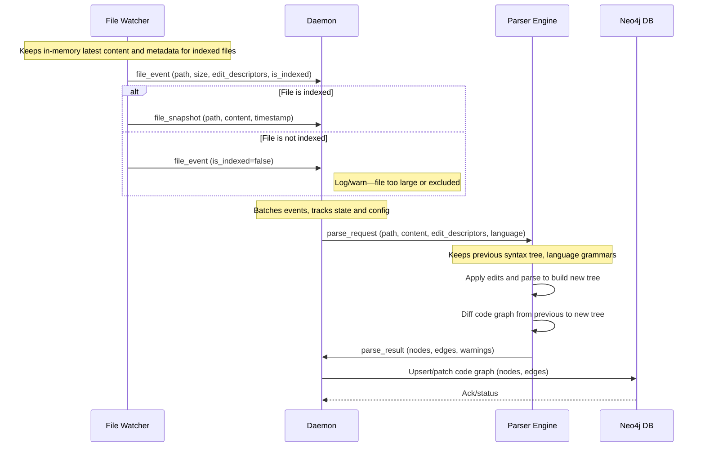

# API Spec

## Internal API Specification



### Overview

All communication between file watcher, update daemon, and code parser occurs
via structured JSON messages over IPC (Unix pipes, sockets) or restricted REST for admin/status.
The API ensures that only source files below the set size limit are incrementally parsed.

***

### IPC Message Endpoints

#### `file_event`

Notifies the daemon of a file creation, modification, or deletion.
Large files or excluded types are filtered before emitting.

```json
{
  "event": "modified",           // "created", "deleted", "modified"
  "path": "/src/foo.py",
  "size": 4235,
  "mimetype": "text/x-python",
  "is_indexed": true,            // false if excluded by size/type
  "edit_descriptors": [
    {
      "start_byte": 140,
      "old_end_byte": 150,
      "new_end_byte": 152,
      "start_point": { "row": 10, "column": 3 },
      "old_end_point": { "row": 10, "column": 15 },
      "new_end_point": { "row": 10, "column": 17 }
    },
    {
      "start_byte": 410,
      "old_end_byte": 415,
      "new_end_byte": 420,
      "start_point": { "row": 35, "column": 2 },
      "old_end_point": { "row": 35, "column": 7 },
      "new_end_point": { "row": 35, "column": 12 }
    }
  ]
}
```

#### `file_snapshot`

Delivers the latest *full* file contents for parsing actions if below size limits.

```json
{
  "path": "/src/foo.py",
  "size": 4235,
  "content": "...file contents...",
  "timestamp": "2025-09-08T14:25:01Z"
}
```

#### `parse_request`

Sent by the daemon to the parser engine to request (incremental) parsing.

```json
{
  "path": "/src/foo.py",
  "content": "...file contents...",
  "edit_descriptor": { /* as above, optional for full reloads */ },
  "language": "python"
}
```

#### `parse_result`

Parser responds with a code graph fragment, or error if unable to parse (e.g., file too large).

```json
{
  "path": "/src/foo.py",
  "success": true,
  "nodes": [ /* canonical nodes (function, class, etc.) */ ],
  "edges": [ /* canonical edges */ ],
  "warnings": [ "skipped deprecated syntax" ]
}
```

***

### Internal REST (Daemon/Watcher Admin)

#### `GET /internal/status`

Returns memory usage, file watcher stats, and exclusion logs.

#### `POST /internal/control`

Control commands (pause, resume, restart, stop) for watchers.

#### `GET /internal/logs`

Fetches detailed event and error logs for debugging and resource auditing.

***

### Policy & Constraints

- Any file over the configured size threshold is reported with `"is_indexed": false`
and skipped for parsing, with a log entry for transparency.
- The daemon maintains a memory budget for cached files and signals watcher subsystems
to evict or skip files when approaching limits.

***

## External API: Query-Focused Specification

The API allows consumers (visualizers, LSP, scripts) to:
- Traverse, search, and filter code entities and their relationships.
- Execute graph queries (upstream/downstream, edge/path following) in a project context.
- Retrieve rich metadata and docstrings for code objects.

### Key Endpoint Types

| Endpoint                                       | Method | Description                                                      | Example Usage            |
|------------------------------------------------|--------|------------------------------------------------------------------|--------------------------|
| `/api/graph/query`                             | POST   | General graph query with parameters for node/edge traversal      | All funcs called by X    |
| `/api/graph/functions`                         | GET    | List/query all functions with flexible filters                   | Flow diagrams, overviews |
| `/api/graph/functions/{function_id}/edges`     | GET    | List all edges (calls, overrides, etc.) from/to a function       | Call hierarchies         |
| `/api/graph/entities`                          | GET    | Generic node/entity search (class, struct, interface, etc.)      | Search/class browser     |
| `/api/graph/path`                              | POST   | Return path(s) between two nodes (functions/classes etc.)        | Dataflow, dependency     |
| `/api/graph/edges`                             | GET    | List edges of specific type(s), option to limit direction        | Calls, inheritance       |

### Example: Filtered Function and Edge Query

Query: "All functions that call (edge: calls) a given node/function."

**POST** `/api/graph/query`
```json
{
  "project_id": "foobar",
  "node_type": "function",
  "edge_type": "calls",
  "direction": "upstream",  // or "downstream"
  "target_id": "func_123",
  "limit": 30
}
```
Returns: List of function node objects matching the filter, optionally with edge context.

### Example: Entity and Relationship Enumeration

- **GET** `/api/graph/functions?called_by=func_123`
  - Lists functions that are directly called by a specific function.
- **GET** `/api/graph/entities?type=classentity&name=Widget*`
  - Fuzzy search for classes matching a prefix.

### Supported Query Options

- Node/entity type (`function`, `classentity`, `structentity`, etc.).
- Edge type (e.g., `calls`, `inheritsfrom`, `implements`).
- Direction (`upstream`, `downstream`).
- Attribute filters (`name`, `language`, `startline`, etc.).
- Result limits, pagination, and sorting for large graphs.

### Technical Details

- Queries are implemented as Cypher behind the scenes, or mapped to efficient Neo4j traversals.
- All endpoints are **read-only**—no code or graph mutations, no triggering of parser/indexing.
- Error/status fields help clarify when a node or relationship is missing.

***
