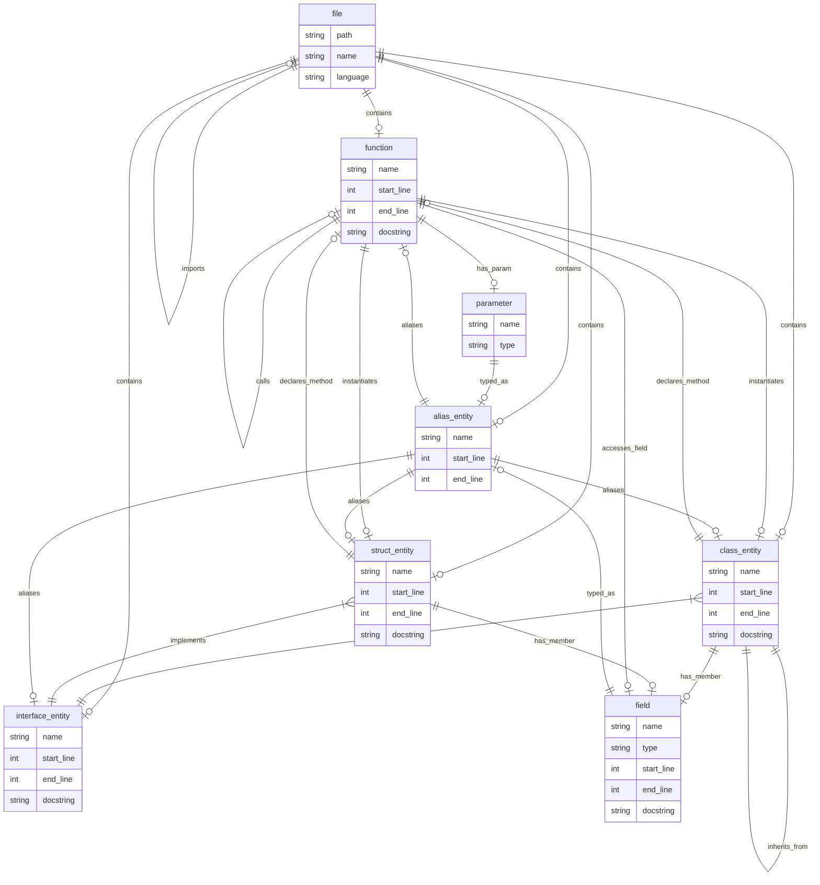

# Connectome Data Structure

This document contains the data structure for storing code graph information for the `connectome` project.

## Overview

---

---

### Nodes

| Node Type       | Key Attributes                                         | Description                                 |
|-----------------|-------------------------------------------------------|---------------------------------------------|
| file            | path, name, language                                  | Source file or code unit                    |
| function        | name, start_line, end_line, docstring                 | Any top-level or member function/method     |
| class_entity    | name, start_line, end_line, docstring                 | Class or class-like type                    |
| struct_entity   | name, start_line, end_line, docstring                 | Struct or value-aggregate type              |
| interface_entity| name, start_line, end_line, docstring                 | Interface/trait/contract                    |
| field           | name, type, start_line, end_line, docstring           | Data member of class/struct                 |
| parameter       | name, type                                            | Function/method parameter                   |
| alias_entity    | name, start_line, end_line                            | Named type alias                            |

### Edges

| Edge Name        | From Node(s)              | To Node(s)                | Description                                   |
|------------------|--------------------------|---------------------------|-----------------------------------------------|
| contains         | file                     | any entity                | File contains code entity/definition          |
| imports          | file                     | file                      | File imports/includes another file            |
| has_member       | class_entity, struct_entity | field                  | Type defines a member/field                   |
| declares_method  | class_entity, struct_entity | function               | Type declares an associated method            |
| inherits_from    | class_entity              | class_entity              | Inheritance between classes                   |
| implements       | class_entity, struct_entity | interface_entity       | Implements an interface/trait/contract        |
| calls            | function                  | function                  | One function/method calls another             |
| instantiates     | function                  | class_entity, struct_entity | Function creates/uses a type                |
| accesses_field   | function                  | field                     | Function or method accesses a field           |
| has_param        | function                  | parameter                 | Function declares a parameter                 |
| typed_as         | field, parameter          | alias_entity              | Member or parameter is typed as alias         |
| aliases          | alias_entity              | class_entity, struct_entity, interface_entity, function | Alias refers to actual type                 |

---

## Node Types

### file

**Description:**  
Represents a physical source file. It is the root container for code entities declared within that file.

**Attributes:**  
- path: file system path  
- name: file name  
- language: programming language

**Tree-sitter Example Mapping:**  
- Most grammars treat the file as the top node in the syntax tree.  
- Example: Tree-sitter Python’s `"module"` node is mapped to `file`.

---

### function

**Description:**  
Any function, method, or lambda block. May be top-level or a member of a class/struct.

**Attributes:**  
- name (can be empty for lambdas)
- start_line
- end_line
- docstring (optional)

**Tree-sitter Example Mapping:**  
- Python: `"function_definition"`, JavaScript: `"function_declaration"`, C: `"function_definition"`, Java: `"method_declaration"`

---

### class_entity

**Description:**  
A class or class-like construct grouping fields and methods, and supporting inheritance.

**Attributes:**  
- name  
- start_line  
- end_line  
- docstring (optional)

**Tree-sitter Example Mapping:**  
- Python: `"class_definition"`  
- Java: `"class_declaration"`  
- C++: `"class_specifier"`

---

### struct_entity

**Description:**  
A struct or similar aggregate type grouping fields (and sometimes methods). May exist in C, Rust, Go, etc.

**Attributes:**  
- name  
- start_line  
- end_line  
- docstring (optional)

**Tree-sitter Example Mapping:**  
- C: `"struct_specifier"`  
- Rust: `"struct_item"`  
- Go: `"type_spec"` (if type is struct)

---

### interface_entity

**Description:**  
An interface/trait/contract, defining expected members/methods but no implementation.

**Attributes:**  
- name  
- start_line  
- end_line  
- docstring (optional)

**Tree-sitter Example Mapping:**  
- Java: `"interface_declaration"`  
- TypeScript: `"interface_declaration"`  
- Rust: `"trait_item"`

---

### field

**Description:**  
A field, property, or data member belonging to a class or struct.

**Attributes:**  
- name  
- type  
- start_line  
- end_line  
- docstring (optional)

**Tree-sitter Example Mapping:**  
- Python: `"assignment"` (in a class body)  
- Java: `"field_declaration"`  
- C: `"field_declaration"`

---

### parameter

**Description:**  
A parameter for a function or method.

**Attributes:**  
- name  
- type

**Tree-sitter Example Mapping:**  
- Python: `"parameters"` (individual child nodes within)  
- JavaScript: `"formal_parameter"`  
- C: `"parameter_declaration"`

---

### alias_entity

**Description:**  
A named alias for another type, used to simplify or create synonyms for types.

**Attributes:**  
- name  
- start_line  
- end_line

**Tree-sitter Example Mapping:**  
- Python: `"type_alias"` (PEP 613)  
- TypeScript: `"type_alias_declaration"`  
- C: `"typedef_declaration"`

---

## Edge Types

### contains
- **From/To:** file ⟶ entity
- **Description:** The file declares or contains the referenced entity.
- **Examples:**  
  - Python: module contains class/function/variable  
  - C: source file contains struct/function

### imports
- **From/To:** file ⟶ file
- **Description:** One file imports, includes, or requires another.
- **Examples:**  
  - Python: `import ...`  
  - Java: `import ...;`  
  - JavaScript: `import ... from ...`  
  - C: `#include ...`

### has_member
- **From/To:** class_entity/struct_entity ⟶ field
- **Description:** The class or struct defines the field.
- **Examples:**  
  - Python: class body declares attribute  
  - Java: class has a field

### declares_method
- **From/To:** class_entity/struct_entity ⟶ function
- **Description:** A class or struct declares an associated method.
- **Examples:**  
  - Java: class contains a method  
  - Go: struct has receiver method

### inherits_from
- **From/To:** class_entity ⟶ class_entity
- **Description:** One class extends/inherits another.
- **Examples:**  
  - Python: `class B(A): ...`  
  - Java: `class B extends A`

### implements
- **From/To:** class_entity/struct_entity ⟶ interface_entity
- **Description:** Class/struct implements an interface or trait.
- **Examples:**  
  - Java: `class X implements Y`  
  - Rust: struct implements trait

### calls
- **From/To:** function ⟶ function
- **Description:** One function calls another.
- **Examples:**  
  - Python: `foo()` calls `bar()`  
  - JavaScript: `a()` calls `b()`

### instantiates
- **From/To:** function ⟶ class_entity/struct_entity
- **Description:** Function instantiates (creates an instance of) a class or struct.
- **Examples:**  
  - Python: `a = A()`  
  - Java: `new B()`

### accesses_field
- **From/To:** function ⟶ field
- **Description:** Function accesses a field.
- **Examples:**  
  - Python: `obj.x`  
  - Java: `obj.y = ...;`

### has_param
- **From/To:** function ⟶ parameter
- **Description:** Function declares a parameter.
- **Examples:**  
  - def foo(x): ...  
  - function greet(name) { ... }

### typed_as
- **From/To:** field/parameter ⟶ alias_entity
- **Description:** A field or parameter is defined as having a type alias.
- **Examples:**  
  - TypeScript: `foo: SomeAlias`  
  - C: `myvar: MY_TYPE`

### aliases
- **From/To:** alias_entity ⟶ [class_entity, struct_entity, interface_entity, function]
- **Description:** The alias refers to another type or function.
- **Examples:**  
  - TypeScript: `type T = string`  
  - C: `typedef unsigned int uint;`

---

