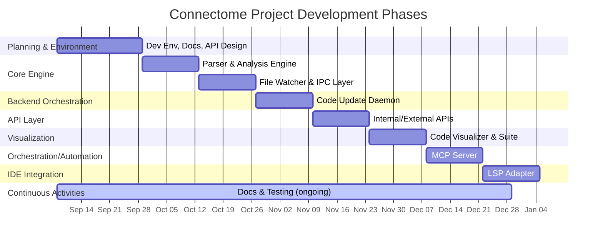

# Connectome Project — Phased Implementation Plan

Below is a **detailed phase breakdown** for the Connectome Project, restructured to maximize
developer focus, rapid iteration, and continuous integration of documentation and testing.
The sequence emphasizes early core infrastructure, contract-first development,
and incremental layering of APIs and UI, with documentation embedded in each phase.
This plan is optimized for a solo developer using AI-assisted methods,
so phases encourage momentum and fast feedback rather than parallelized team workflows.

***

## Phase 0: Development Environment, Docs, and API Design

- Establish a unified Nix development environment supporting Python, Rust, and Go.
- Draft and maintain comprehensive project and architectural documentation from the very beginning.
- Prepare initial and sample Neo4j configuration for seamless local and test deployments.
- Design and document both internal (daemon, watcher, parser, etc.)
and external (REST, MCP, visualization) API contracts and protocols.
Use these contracts to inform stubs/mocks for future phases.
- Create basic automation: onboarding scripts, developer templates, and baseline CI if applicable.

### Goals:
- No ambiguity about environment or stack requirements.
- API and data contracts guide all future development.
- Documentation starts early and grows with the code.

***

## Phase 1: Core Parsing & Analysis Engine

- Implement the Rust-based code parser and static analysis engine,
targeting the project’s supported languages with `tree-sitter` and `tree-sitter-graph`.
- Ensure output matches the node/edge data model defined in the data structure documentation.
- Build a robust test harness to validate graph extraction on real and sample projects.
- Generate well-documented artifacts (data samples, test logs) for downstream component integration.

### Goals:
- Reliable graph output on demand (file and project level).
- Easy to test and inspect analysis output separate from later stages.

***

## Phase 2: File Watcher & Interprocess Communication Layer

- Build the Rust file watcher subprocess using `notify`, CLI configuration crates,
and serialization with `serde`.
- Define and implement the interprocess communication (IPC) layer (pipes/stdin-stdout with JSON protocol,
or sockets as needed) to interface with the main daemon.
- Simulate file system events in early tests to drive parser and validate end-to-end ingest flows.
- Document IPC protocol and event formats as part of the working repo.

### Goals:
- Automated and granular change detection works repeatedly and robustly.
- Clear, testable communication between watcher, parser, and later the daemon.

***

## Phase 3: Code Update Daemon

- Develop the Go-based code update daemon responsible for lifecycle orchestration:
launching subprocesses, ingesting file events, invoking parsing, batching,
and writing graph updates to Neo4j.
- Integrate daemon with both the parser and watcher via IPC.
- Focus on event ordering and batching logic. Ensure transactional integrity
to Neo4j regardless of event timing.
- Implement detailed logging and error handling.
- Run integration tests spanning local changes through to code graph ingestion.

### Goals:
- End-to-end workflow (file changes → Neo4j) works reliably for real projects.
- All error conditions and failure modes have robust, logged handling.

***

## Phase 4: Internal/External API Endpoints

- Implement REST APIs (using FastAPI and related tools) for both internal system use
and eventual frontend/data consumer access.
- Cover essential endpoints: code/project query, graph inspection, project orchestration,
and health/status endpoints.
- Begin with minimal API surface to support integration testing of future visualization and LSP components.
- Document the API with OpenAPI/Swagger or similar, maintaining in-sync docs for rapid prototyping.

### Goals:
- System can be queried and orchestrated through stable APIs.
- Future client/visualizer code can progress confidently based on real or stubbed responses.

***

## Phase 5: Code Visualizer & Suite

- Bootstrapped using TypeScript/React (or equivalent) with early focus on UI/UX scaffolds
and mock API contracts.
- Integrate with real data/API as soon as possible.
- Implement core UI flows: graph exploration, code navigation, project overview.
- Use contract-driven development: start with wireframes + fake data,
then plug into live endpoints for rapid progress.

### Goals:
- Visualization components grow alongside maturing APIs.
- UI surfaces act as feedback loop for data and API design quality.

***

## Phase 6: MCP Server Implementation

- Develop the Python-based MCP (“Meta Control Point”) module to orchestrate advanced admin,
automation, and metadata lifecycle flows.
- Extend or refactor internal APIs as needed to elevate orchestration capabilities.
- Provide tools for project management, metadata injection, and system state queries.

### Goals:
- Automation, admin, and advanced workflow features centralized and reliable.
- Server can handle multi-project, bulk, or scripted operations efficiently.

***

## Phase 7: Language Server Protocol (LSP) Adapter

- Build the Rust LSP component utilizing `tower-lsp`, async IO, and the code graph data APIs.
- Provide navigation, completion, and on-demand project analysis to IDEs via standard LSP features.
- Include protocol fuzzing and edge-case validation (with early protocol tests
if possible from previous phases).

### Goals:
- VSCode and other IDEs integrate deeply with live project graphs.
- LSP implementation is robust to real-world and edge-case inputs.

***

## Continuous Documentation & Testing

- Each phase concludes only after updating documentation (in docstrings, README, or architecture docs)
and expanding test coverage to include new risk surfaces.
- Documentation is always living and moves with feature development.
- Whenever a component or API is stabilized, generate usage examples and troubleshooting guides.

***

## Summary Table

| Phase | Focus                               | Key Output                                             |
|-------|-------------------------------------|--------------------------------------------------------|
| 0     | Env, Docs, API Contracts            | Unified dev env, sample configs, contract docs         |
| 1     | Parser/Analysis Engine              | Rust library/binary, test artifacts, output samples    |
| 2     | File Watcher & IPC                  | File watcher, IPC layer, protocol documentation        |
| 3     | Code Update Daemon                  | Event orchestrator, batching logic, integration tested |
| 4     | Internal/External APIs              | REST endpoints, API specs, early client hooks          |
| 5     | Visualizer Suite                    | Web UI scaffolds, integrated with backend APIs         |
| 6     | MCP Server                          | Admin/automation layer, project orchestration tools    |
| 7     | LSP Adapter                         | IDE features, navigation, live code graph LSP          |

***

This plan ensures development remains **fluid, testable, and well-documented** at every stage, aligned with solo/AI-augmented workflows and designed for continuous learning and improvement.[2][1]

[1](https://ppl-ai-file-upload.s3.amazonaws.com/web/direct-files/attachments/79945888/66ee76c3-6b69-4e93-a35f-56b61488b60d/TechStack.md)
[2](https://ppl-ai-file-upload.s3.amazonaws.com/web/direct-files/attachments/79945888/46d6d3a6-1085-4428-b5cf-8aff908c16f4/DataStructure.md)
