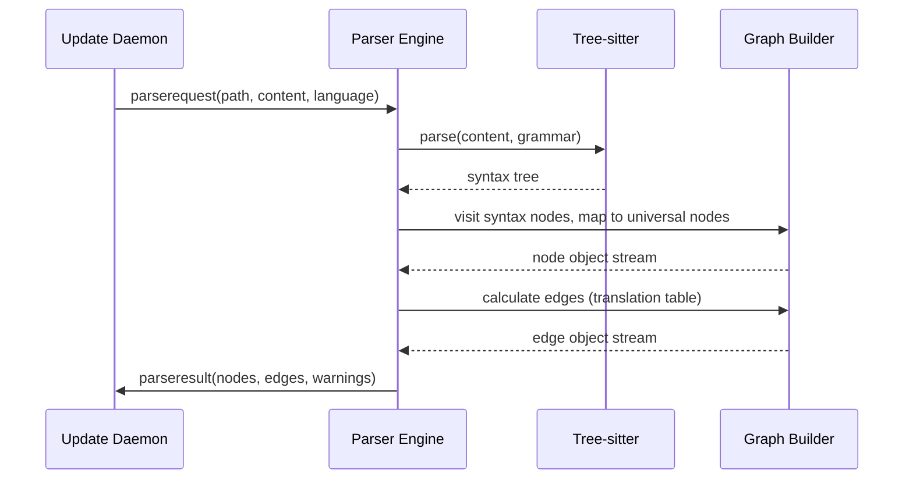

# Phase 1 PRD: Core Parsing & Analysis Engine

## Goal
Implement the Rust-based code parser and static analysis engine targeting the project’s supported languages using tree-sitter and tree-sitter-graph. Output must match the node/edge data model defined in the data structure documentation. Establish a robust test harness to validate graph extraction on real and sample projects. Generate documented artifacts (data samples, test logs) for downstream integration.

## Key Deliverables
- Rust code parser and static analysis library/bin using tree-sitter and tree-sitter-graph.
- Translation table mapping each language grammar node to the Connectome universal node schema.
- Edge calculation logic for node relationships as defined in the canonical model.
- JSON output of nodes and edges in canonical format, suitable for ingestion by downstream daemons and Neo4j.
- Test harness and artifacts covering canonical codebases for validation and integration tests.

## Acceptance Criteria
- Reliable graph output for files and complete projects, matching the documented node/edge schemas.
- All parser operations are reproducible and validated with CI or test suite.
- Output is separable, testable, and can be inspected with downstream tools.
- Each output sample is fully documented and checked against the universal translation and connectivity model.
- Artifacts and translation tables are incorporated into primary project documentation.

***

## Parser Algorithm Workflow



***

## Universal Parsing Flow

```mermaid
flowchart TD
    A[Receive source file + language] --> B{Tree-sitter parse}
    B --> C[Get syntax tree]
    C --> D[Walk syntax tree nodes]
    D --> E{Node Translation Table}
    E --> F[Create universal node objects]
    F --> G{Edge Relation Calculation}
    G --> H[Emit edge objects: calls, inherits, hasmember, etc.]
    H --> I[Output graph: {nodes, edges, warnings}]
```

***

## Detailed Steps

1. Receive file content and language type.
2. Parse file with tree-sitter for given grammar to obtain full syntax tree.
3. Walk the syntax tree; for each grammar node, apply the translation table to yield universal node types (file, function, classentity, structentity, interfaceentity, field, parameter, aliasentity).
4. For each node, extract all canonical properties (names, line numbers, docstrings) following the universal node schema.
5. Compute edges by pattern-matching parent/child, calls, inheritance, implementation, field membership, parameterization, instantiation, and alias references using translation rules for each language/grammar.
6. Collect all nodes and edges; validate referential integrity and edge correctness.
7. Emit output bundle: array of nodes and array of edges, optionally with parse warnings and mapping metadata.

***

## Canonical Translation Table Example

| Syntax Node             | Universal Node      | Methods/Properties Extracted         |
|-------------------------|--------------------|--------------------------------------|
| function_definition     | function           | name, startline, endline, docstring  |
| class_declaration       | classentity        | name, startline, endline, docstring  |
| struct_declaration      | structentity       | name, startline, endline, docstring  |
| interface_declaration   | interfaceentity    | name, startline, endline, docstring  |
| field_declaration       | field              | name, type, startline, endline       |
| parameter_declaration   | parameter          | name, type                           |
| type_alias              | aliasentity        | name, startline, endline             |
