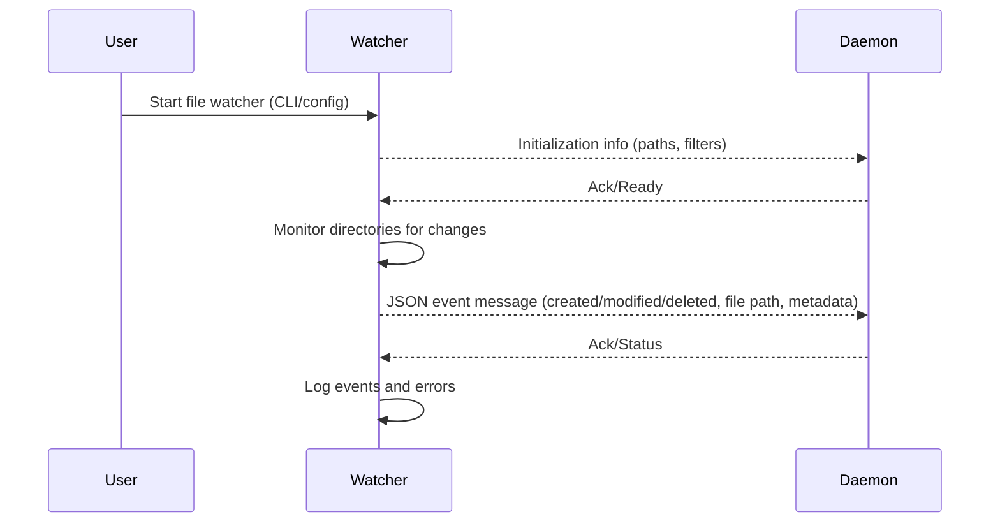
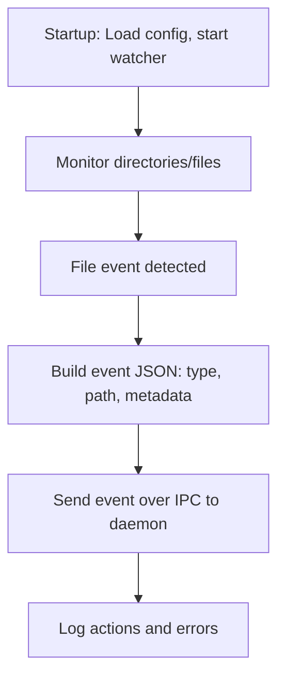

# Phase 2 PRD: File Watcher and IPC Layer

## Goal
Develop the Rust file watcher subprocess using the notify crate, CLI configuration, and serde serialization. Define and implement the interprocess communication (IPC) layer using pipes (stdin-stdout) with a JSON protocol, or sockets as needed to interface with the main daemon. Provide event simulation and documentation of event/message formats.

## Key Deliverables
- Rust file watcher subprocess detecting file and directory changes.
- CLI configuration for target directories, filters, and options.
- JSON serialization of file events using serde.
- IPC protocol using pipes or sockets for structured message exchange.
- Stubs for event simulation for early-stage integration testing.
- Documentation of event formats, message types, and protocol.
- Robust logging for watcher actions, errors, and state.

## Acceptance Criteria
- Watcher detects file and directory changes on Linux and macOS.
- IPC events are valid, schema-compliant JSON.
- End-to-end event flow between watcher and parser/daemon is testable and robust.
- All event and message formats are documented in project docs.
- Watcher runs standalone or under system supervision with reproducible behavior.

***

## File Watcher Sequence Diagram

***

## File Watcher Flowchart

