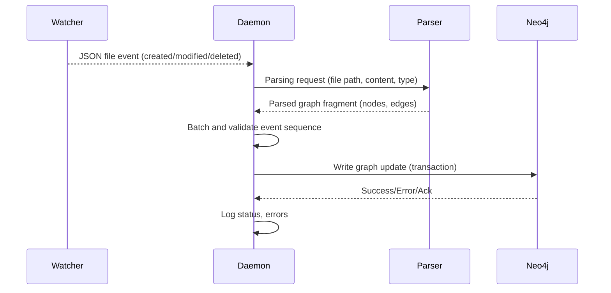
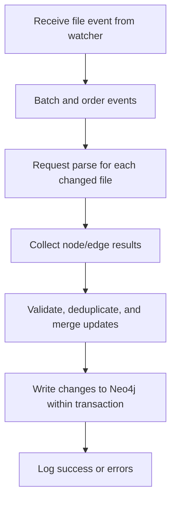

# Phase 3 PRD: Code Update Daemon

## Goal
Develop the Go-based code update daemon responsible for process orchestration: launching subprocesses,
ingesting file events, invoking parsing, batching updates, and writing graph changes to Neo4j.
Integrate daemon with both the parser and watcher via IPC. Ensure transactional integrity, logging,
and error handling are implemented and run full integration tests from raw file changes to code graph ingestion.

## Key Deliverables
- Go daemon managing watcher and parser subprocess lifecycles.
- IPC handlers for ingesting file events and delivering parsing requests/results.
- Event batching logic to ensure ordered, efficient updates.
- Write canonical, validated updates to Neo4j database.
- Detailed error and status logging.
- Integration and failure path tests from event ingestion to graph persistence.

## Acceptance Criteria
- End-to-end workflow reliably processes file changes and updates Neo4j for real projects.
- Robust error handling and logging across all subsystems.
- Daemon can be run manually or as a service.
- All code paths and failure modes are documented and tested.

***

## Code Update Daemon Sequence Diagram

***

## Daemon Event Processing Flowchart

