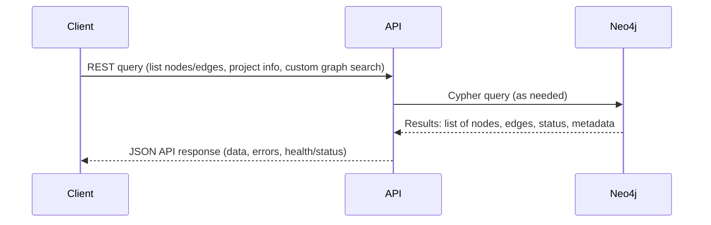

# Phase 4 PRD: Internal and External API Endpoints

## Goal
Implement REST APIs using FastAPI for both internal system use and client/frontend access. Cover essential endpoints for project and code queries, graph inspection, orchestration actions, and system health/status. Maintain complete, in-sync API documentation and enable contract-driven integration for visualizer and LSP components.

## Key Deliverables
- FastAPI-based REST server with endpoints for project queries and operations.
- Endpoints for graph query/filtering, node/entity listing, edge/relationship enumeration, and code/project orchestration.
- Health and status endpoints for system monitoring.
- API schema and docs auto-generated and kept in sync.
- CI-validatable API contracts and usage samples.

## Acceptance Criteria
- API surface covers project, node, edge, graph, status, and orchestration functions.
- Endpoints support needed data for visualization and LSP layers.
- API documentation is served and matches implementation.
- Endpoints are CI-tested for correctness and stability.
- System health checks and status endpoints are exposed.

***

## API Server Sequence Diagram



***

## API Request Handling Flowchart

```mermaid
flowchart TD
    A[Receive REST API request] --> B[Validate parameters and auth]
    B --> C[Determine query type: node, edge, graph, status]
    C --> D[Translate request to Cypher or data op]
    D --> E[Query Neo4j and collect results]
    E --> F[Format JSON response (data, errors, status)]
    F --> G[Send response to client]
```
