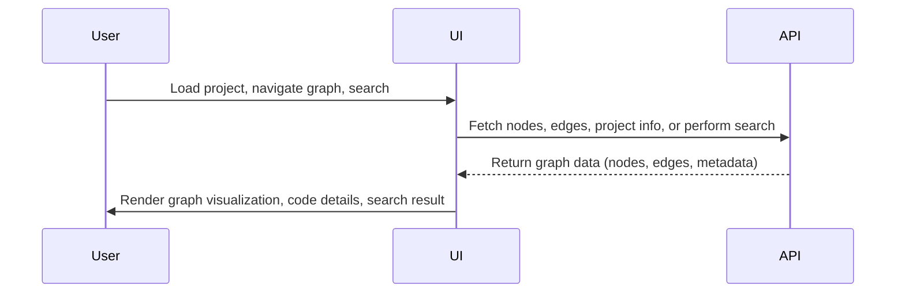
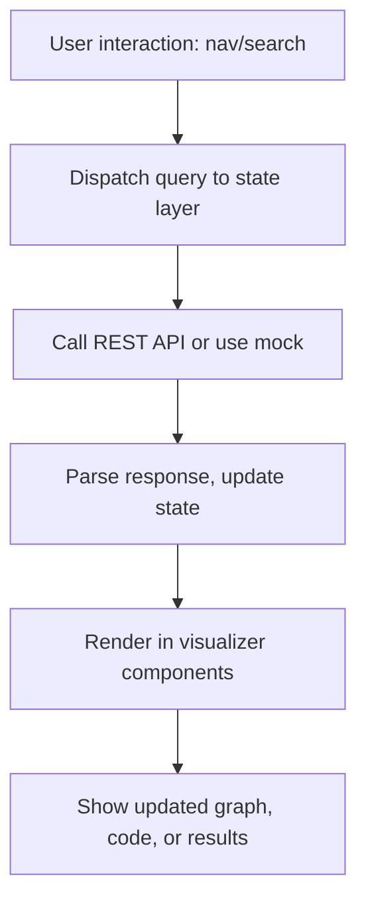

# Phase 5 PRD: Code Visualizer Suite

## Goal
Bootstrap the TypeScript/React-based code visualizer suite focused on interactive code graph exploration, code navigation, and project overview UI. Integrate the UI with live and mock API endpoints, prioritizing contract-driven development, core UX flows, and rapid prototype iterations.

## Key Deliverables
- TypeScript/React visualizer scaffolding with core navigational components.
- Integration with backend REST APIs for nodes, edges, graph search, and metadata.
- Mock API layer to enable parallel UI/UX and backend development.
- Interactive graph visualization, search, drill-down, and navigation views.
- Core state management, project selection, and UI structure.
- UX wireframes and functional skeletons with contract-based data flows.

## Acceptance Criteria
- Visualizer can connect to API endpoints for real project data and fall back to mock data for development.
- Supports graph navigation, entity search, code browsing, and full project overview.
- Essential user flows for project loading, navigation, and query are implemented.
- Components and data flows reflect the agreed API contracts.
- Automated and manual tests verify core interactions.

***

## Visualizer Suite Sequence Diagram

***

## UI Component/Data Flow

