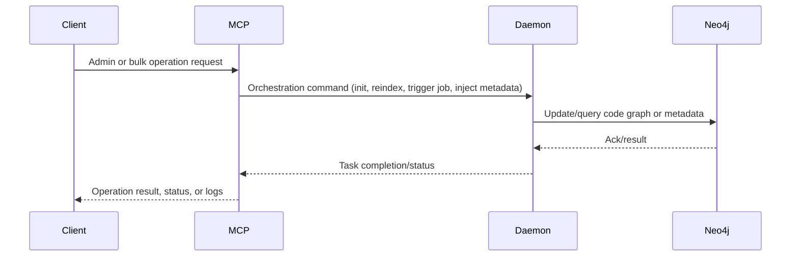
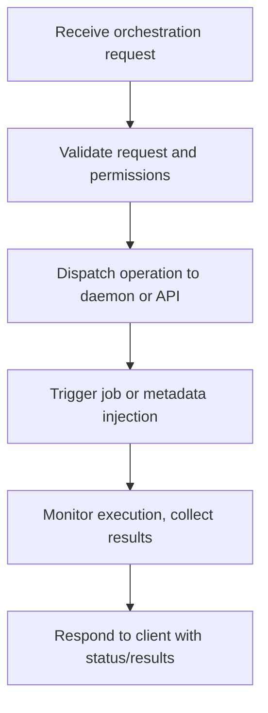

# Phase 6 PRD: MCP Server Implementation

## Goal
Develop the Python-based MCP (Meta Control Point) server to orchestrate advanced admin, automation, and metadata lifecycle flows. Extend or refactor internal APIs to support advanced orchestration, project management, and metadata injection. Provide tools and endpoints for project monitoring, state queries, and bulk or scripted operations.

## Key Deliverables
- Python FastAPI MCP server with orchestration and admin endpoints.
- Extended API contracts for metadata lifecycle and project automation.
- Project management, metadata injection, and system state query endpoints.
- Logging, task scheduling, and auditing workflows.
- CLI and web utilities for invoking MCP server functions.
- Documentation of orchestration flows, APIs, and usage examples.

## Acceptance Criteria
- MCP server supports automation and admin flows for multi-project and bulk operations.
- Endpoints enable advanced orchestration, state queries, and project-level metadata manipulation.
- All orchestration and state APIs are documented, versioned, and tested.
- CLI/web utilities interact with MCP server and reflect orchestration status.

***

## MCP Server Sequence Diagram

***

## MCP Orchestration Flowchart

