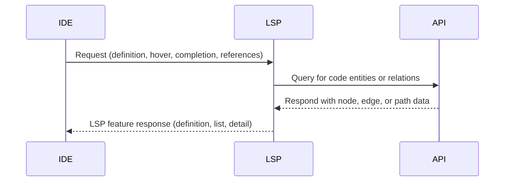
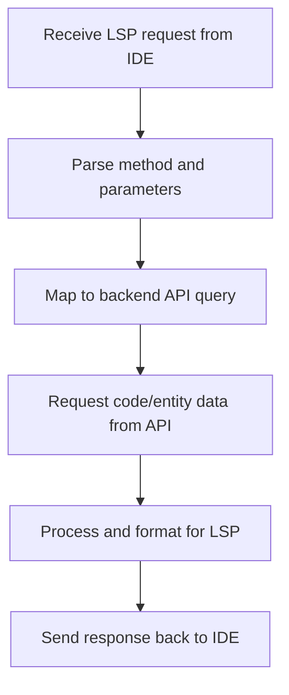

# Phase 7 PRD: Language Server Protocol (LSP) Adapter

## Goal
Build the Rust-based LSP adapter using tower-lsp and async IO, connecting IDEs to live project graphs and supporting navigation, completion, and code analysis. Integrate with project APIs for code entity and relation queries, delivering LSP features like references, go-to definition, and document highlights.

## Key Deliverables
- Rust LSP server implementing standard LSP features.
- Async integration with backend APIs and code graph data.
- IDE support for navigation, completion, reference search, and cross-reference queries.
- Protocol tests and coverage for edge-case handling and robust communications.
- LSP documentation for setup and integration.

## Acceptance Criteria
- LSP server provides navigation, completion, and inspection features for supported IDEs.
- End-to-end queries resolve against live code graphs through the API.
- Robust handling of edge cases, disconnections, and invalid project states.
- Tests validate protocol compliance and real-world IDE use.

***

## LSP Adapter Sequence Diagram

***

## LSP Request Handling Flowchart

