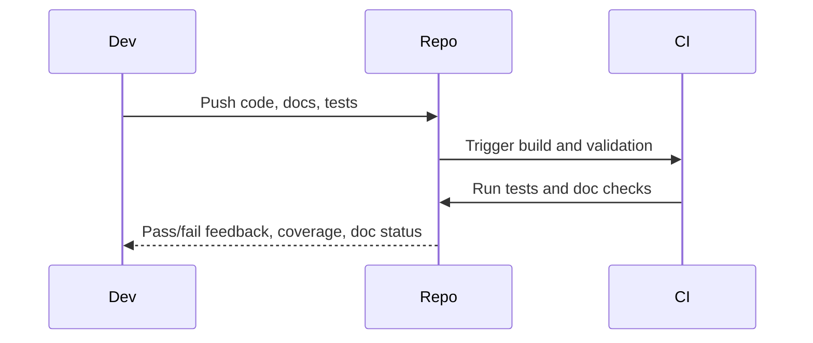
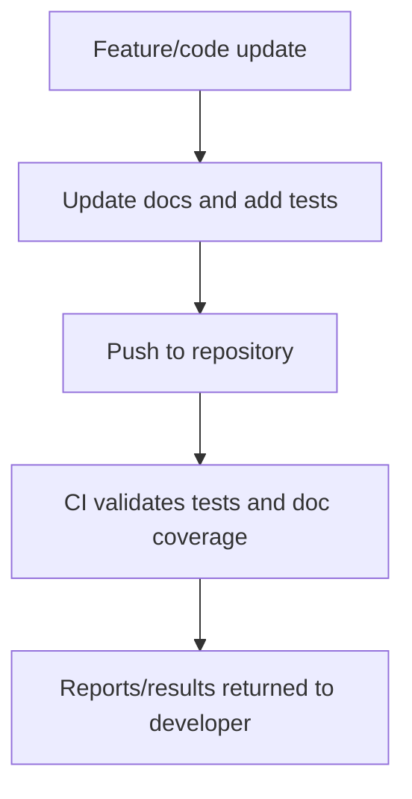

# Phase 8 PRD: Continuous Documentation and Testing

## Goal
Ensure all phases and components are accompanied by precise, continuously updated documentation and comprehensive tests. Documentation is to be integrated with the codebase, covering APIs, architecture, configurations, usage examples, and troubleshooting. Testing must validate all APIs, workflows, and risk surfaces, with CI enforcement.

## Key Deliverables
- Embedded docstrings, README updates, and architectural docs with each feature.
- Generation and publishing of usage examples and troubleshooting guides.
- Automated and manual test coverage for all code paths, APIs, and edge cases.
- CI/CD integration to enforce documentation and test completeness.
- Status dashboards or reports for documentation and test health.

## Acceptance Criteria
- All components and APIs have updated, discoverable documentation and real-world usage examples.
- Tests span all risk surfaces and enforce regressions are caught in CI.
- Documentation and test artifacts reflect current implementation and are part of the main repository.
- Enforcement of submission of documentation and tests for each feature/change.

***

## Documentation and Testing Sequence Diagram

***

## Doc/Test Lifecycle Flowchart

